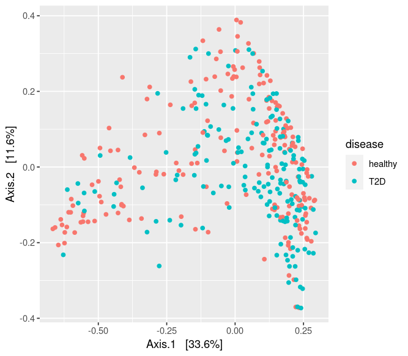

# Introduction to microbiome data

---

### 1. About microbiome

- **Disbiosis** is the alteration of the microbial composition equilibrium. Disbiosis is associated with illnes when pathogenic microorganisms are favoured over symbiotic ones. 

- Besides disbiosis, reduction of microbial diversity is also associated with disease. 

- Metagenomic data are informative on the functional potential of a given microbial population, since it provides both the genes present in the population and the abundances of this genes.


### 2. Descriptive analyses and visualization

#### Heatmaps for distribution of abundances
Microbial abundances are zero-inflated, meaning that most microorganisms are present in only a few samples. Moreover, the are highly leptokurtic: few microorganims are very abundant in comparison with the rest. A **heatmap of abundances** can be a nice way to visualize both properties in our dataset. 

|  |
| |
| **Figure 1.** Heatmap built from our QC-filtered PIGBIOTA data (2945 ASVs). *It is not very informative, but maybe with less ASVs (most prevalent ones) it would be more useful.* |

> *A raíz de esto, se me ocurre que podríamos comparar como afecta el QC para los análisis de inferencia. ¿Se obtendrán los mismos resultados si empleamos 2945 ASVs que si empleamos los ~400 ASVs más prevalentes? En teoría los que se eliminarían deberían ser poco informativos, pero quizá detectan microorganismos con poca prevalencia pero con mucho efecto...*


#### Rarefaction curves for coverage
Rarefaction curves plot the **observed richness against different rarefaction depths**. 

|  |
| |
| **Figure 2.** Example rarefaction curve. *Figure taken from the course presentation (1), slide 63.* |

If a curve is reaching a *plateau*, then the sample has enough coverage and captures decently the its microbial composition (M31Fcsw and M11Fcsw curves in *Figure 2*). However, if there is still a great increase in richness with increasing sequencing depths, more coverage would be neccesary for those samples (SV1, CL3 and CC1 in *Figure 2*). 


#### Alpha-diversity: indexes explained

These are important because, like previously noted, a reduced diversity is associated with disease in humans.

**Chao1:** applies a correction to richness (observed number of species), taking into account singletons and doubletons (microorganisms that are observed only once or twice, respectively). 

**Shannon:** measures the evenness of the abundance distribution. Its interpretation is difficult, it depends on the values of the other samples.

**Effective number of species:** it provides an easier interpretation than Shannon index. It indicated the number of species that "dominate" the sample. It is calculated as the exponential of the Shannon index. 

```{r}
effective_number_species <- exp(shannon_index)
```


#### Beta-diversity: distances explained

A good **ecological distance describes the difference in species compositions**. The euclidean distance is not a good ecological distance, as can be seen in *Figure 3*:

|  |
| |
| **Figure 3.** Toy example for the bias introducid by Euclidean distance as an ecological distance. *Figure taken from the course presentation (1), slide 65.* |

In the toy abundance table in the left of *Figure 3*, we can see that samples A and B composition are more similar between them than compared to C. The have the same microorganisms, they just differ in the abundances. However, the smallest euclidean distance (*Figure 3, right*) is the pair A-C.  

The following distances or *dissimilarities* are commonly used as ecological distances:

- **Bray-Curtis dissimilarity:** absolute value of the diference between the abundances divided by the sum of the abundances. 

- **Jaccard dissimilarity:** divides the sum of the minimum abundances of each pair of samples between the sum of the maximum. 

- **UniFranc dissimilarity:** takes into account the phylogenetic relationship of microorganisms. It is the sum of the length of unique branches (only on one sample) for each taxa divided by the sum of the length of braches that contain both taxa (*Figure 4*)

|  |
| |
| **Figure 4.** Toy example for the UniFranc distance *Figure taken from the course presentation (1), slide 67.* |

- **weighted-UniFranc dissimilarity:** same as the unweighted, but it also takes into account the relative abundance of each taxa. 

It is important to note that dissimilarities are valid for "raw" abundances, but **but bias appears with relative abundances**. Compositional transformations (like Total Sum Scaling) restrict the space of the values because of the elements in the sample have to sum 1. This reflects in the ordinations, like can be appreciated in *Figure 5*:

|  |
| |
|  |
| **Figure 5.** Examples for the MDS ordination using Bray-Curtis and weighted-UniFranc distances for PCoA (MDS) ordination *Figures generated in the exercise 2. g) of the course [practical exercise](materials/practical_exercise1.R).* |


#### Beta-diversity visualization: ordination

Visualization of beta-diversity is usefull for identifying possible data structures. **Ordination is the graphical representation of data along a reduced number of orthogonal axes** while preserving distance relationships as well as possible. PCA preserves Euclidean distance, and thus it is not appropiate for abundances. 

> **NOTE: it is appropiate for log-ratio transformed abundances (for example, CLR-transformed abundances).**

**PCoA (also called multidimensional scaling or MDS) is** an extension of PCA that is **useful for representation of beta-diversity dissimilarities**. The main difference is that PCA performs eigenvalue decomposition on the covariance matrix (calculated from data matrix), while PCoA does it on the a matrix calculated **from centered distance matrix**. For the Euclidean distance, PCA = PCoA. 

For non-metric dissimilarities (or distances), eigenvalue decomposition might not be optimal like it is for euclidean distances ([*slide 74*](materials/MCalle_slides_microbiome_UPC2022_1.pdf)). For this cases, we have Nonmetric Multidimensional Scaling (NMDS). It is an iterative algorithm that maximizes the rank-based correlation between the original distances and the distances in the new ordination. 

---

###### 20/06/2022