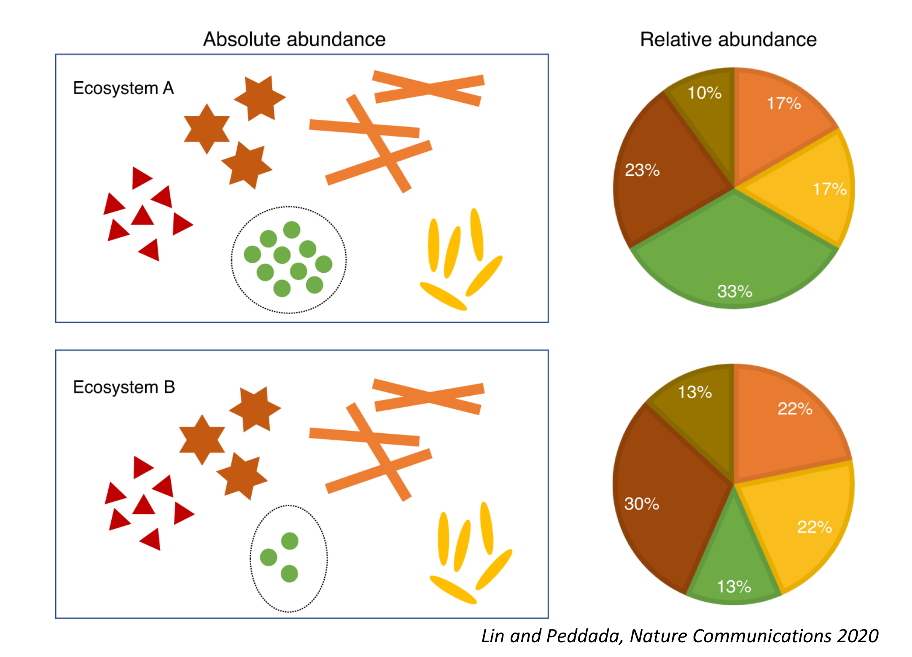
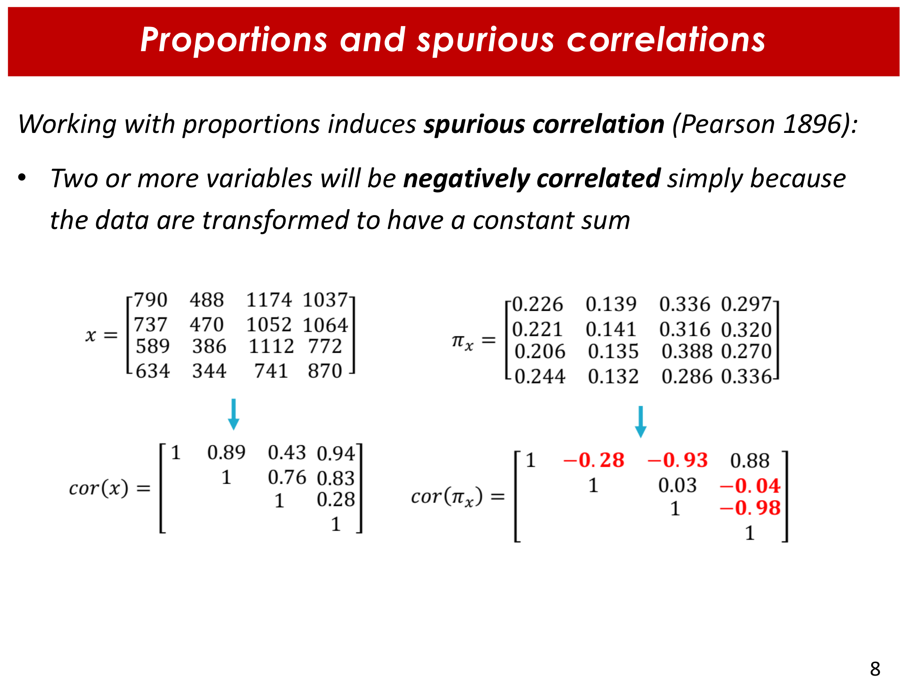
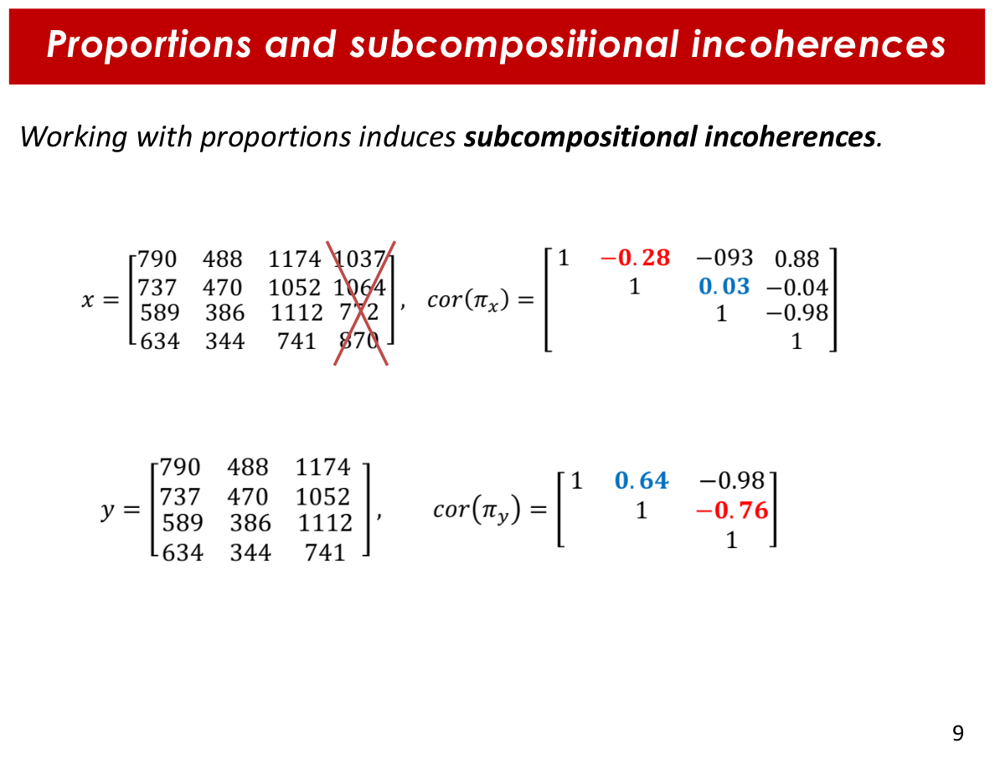
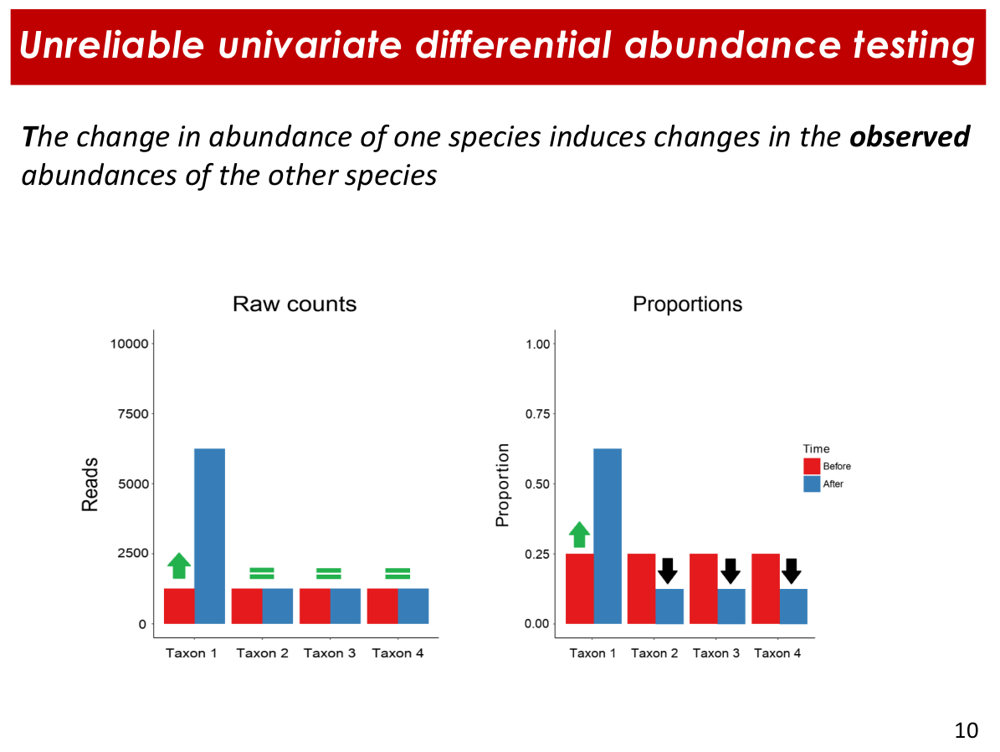
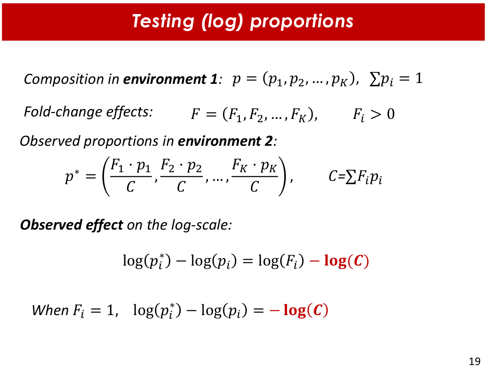
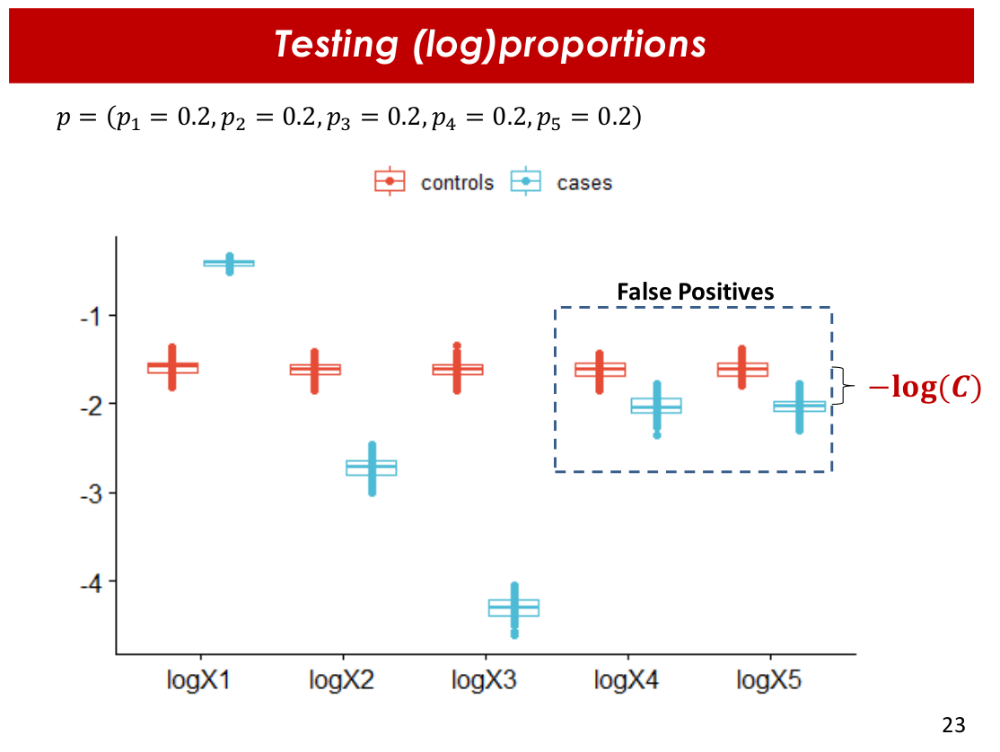
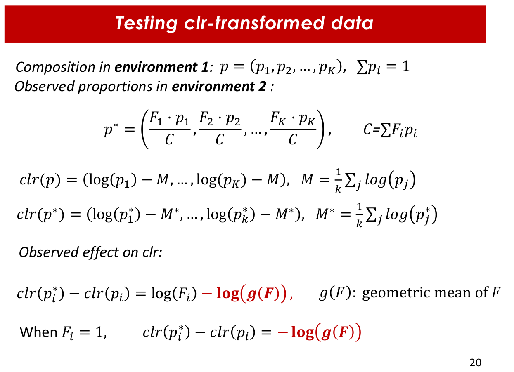
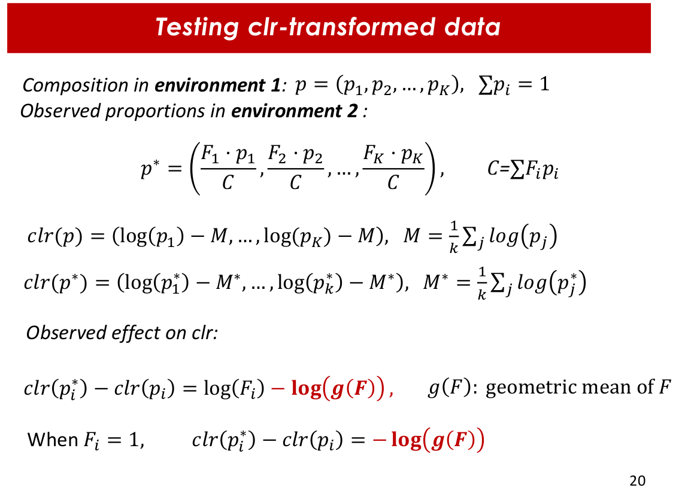

# Compositionality of microbial abundance data

*For this section we use both [Presentation 1](materials/MCalle_slides_microbiome_UPC2022_1.pdf) and [Presentation 2](materials/MCalle_slides_microbiome_UPC2022_2.pdf)*

---

### 1. Multivariate testing

*[slides 77 and 78 of [Presentation 1](materials/MCalle_slides_microbiome_UPC2022_1.pdf)]*

The PERMANOVA ananlysis compares within class variation between two or more different classes. The *adonis* function of the *vegan* R package performs a **multivariate ANOVA** based on dissimilarites (ecological distances), which is the same as a PERMANOVA. 
> *perm* comes from "permutations", since they are used to generate a distribution of a pseudo-statistic F under the nulle hypothesis for the evaluation of significance. 

In this example, we tested for differences in the different sample types of the dataset used for practice (*GlobalPatterns*):
``` {r}
adonis2(BC.dist.human~sample_data(data.human)$SampleType)
Permutation test for adonis under reduced model
Terms added sequentially (first to last)
Permutation: free
Number of permutations: 999

adonis2(formula = BC.dist.human ~ sample_data(data.human)$SampleType)
                                   Df SumOfSqs      R2      F Pr(>F)   
sample_data(data.human)$SampleType  2   1.5534 0.46469 2.6042  0.002 **
Residual                            6   1.7895 0.53531                 
Total                               8   3.3429 1.00000                 
---
Signif. codes:  0 ‘***’ 0.001 ‘**’ 0.01 ‘*’ 0.05 ‘.’ 0.1 ‘ ’ 1
```
Differences were found, and the probability of those differences being due to chance (p.value) were 0.002. 


### 2. Compositional data analysis

*[[Presentation 2](materials/MCalle_slides_microbiome_UPC2022_2.pdf)]*


With compositional data (CoDa) like microbial abundances we can only aim for a representation of what is happening there, but it is not possible to obtain the true composition. Furthermore, the different samples have different total counts, which makes them non comparable. Therefore, this data is normally analysed in terms of **relative data**. The main problem with **relative data** is that it **is restricted: all the elements add up to a certain value** (usually 1). With this restriction come some important problem.


#### Problems of compositional data for its analysis

Let's imagine this scenario, illustrated by *Figure 1*: we have two different samples composed by the same elements, and have exactly the same "absolute" abundances for all of the elements except for one. However, **one change in the "absolute" abundance modifies the relative abundances of all elements**. 

|  |
| |
| **Figure 1.** Illustration of a toy example where two samples have identical aboslute values for all its elements except for one, which leads to completely different relative compositions. *Figure taken from course presentation (2), slide 4* |

This characteristic of compositionall data comes with certain problems. For the analysis of microbiome data, we highlight the following three:

**Supurious correlations:** analyzing restricted data (in this case, the sum of all values is equal to 1) leads to spurious correlations, since when an element increases its relative abundance, the others decrease theirs (*Figure 2*). 

> Mathematically, **if we have a dataset with two taxas and any given number of samples, the correlation between their relative abundances is always -1**: there is an **inverse, proportional change in their relative abundances** because when one *increases*, the other one *decreases* (the reason for the negative "-" sign) with a change of the same magnitude (here you have the "1", because it is completely proportional). In a more complex dataset (more taxa) just because of the transformation in relative abundances, two or more variables will obtain negative correlations, even if there is no negative correlation between "absolute" abundances. **The more taxa you have, the least bias you will obtain.** But not any kind of taxa, but mainly effective components (Shannon's index exponential, *Day 1 lesson*). 

**Subcompositional incoherences:** correlation between two taxa differ when a third taxa is removed (variable selection, for example (*Figure 3*). 

**False positive rates in differential abundance testing:** as a consecuence of the mentioned challenges, it is frequent to obtain a high rato of false positives when analyzing compositional data (*Figure 4*).

[comment]: <> (SAME WITDH FOR ALL CELLS IN TABLE BELOW)
<style>
table th:first-of-type {
    width: 33%;
}
table th:nth-of-type(2) {
    width: 33%;
}
table th:nth-of-type(3) {
    width: 33%;
}
</style>

|  |  |  |
| | | |
| **Figure 2.** Toy example for spurious correlations. *Figure taken from course presentation (2), slide 8.* | **Figure 3.** Toy examplefor subcompositional incoherence. *Figure taken from course presentation (2), slide 9.* | **Figure 4.** Toy example for false positive in differential abundance testing. *Figure taken from course presentation (2), slide 10.* |


#### Properties of compositional data

The fact that information is relative means that each data point does is not informative *per se*, it depends on the values of the other elements. This restricted space where the composition is defined is called **simplex**, and it has a different geometry due to its restriction.

The three main principles of CoDa are:

1. **Permutation invariance:** elements can be arrenged in any given order without affecting analyses
2. **Scale invariance:** multiplying by a constant should not affect the analyses. 
3. **Sub-compositional coherence:** important, since we usually work with sub-compositions (i.e., variable selection)

We will focus on the last two of them

###### Scale-invariat transformations

This transformations allow to move our date from the *simplex* to the real space maintaining the distance between samples. The most popular and simple transformations are log-ratios. There several types: **log-proportions** (log TSS), **alr**, **clr**, etc.
> In clr-transformation, the log of each abundance is divided by the geometric mean of the abundances. The geometric mean is the arithmetic mean of the log values. 

However, **these transformations apply a certain bias when calculating the differential abundance between two samples**. As we can see in *Figure 5*, log-proportions have a bias that depends on both the changes in abundances and in the proportions of the abundances. 

| **LOG-PROPORTIONS (log-TSS) TRANSFORMATION** |
| |
|  | 
| **Figure 5.** Bias of log-proportions transformation depends on fold-change between analyzed samples and on the abundances. *Figure taken from course presentation (2), slide 19.* |
| |
|  |
| **Figure 6.** Example with toy dataset of the bias induced by log-proportions transformation. *Figure taken from course presentation (2), slide 23.* |

For clr-transformation, there is still bias but it only depends on the fold change of the abundances between the samples (*Figure 7*). 

| **CLR TRANSFORMATION** |
| |
|  |
**Figure 7.** Bias for clr-transformation depends on the geometric mean of the fold change. *Figure taken from course presentation (2), slide 20.* |
| |
|  |
| **Figure 8.** Example with toy dataset of the bias induced by clr transformation. *Figure taken from course presentation (2), slide 23.* |


#### Proposed solution: compositional balances (coda4microbiome)

**There is no transformations that entirely solves this problems**. Similar to CLR, there are some other transformations like ARL or IRL, but all of them have some drawbacks. Malu and his colaborators came up with a different approach as a **solution**: using **log-contrasts, which refer to the balances between two sub-compositions (taxa A and taxa B) of a composition.** 

The latest approach for this solution was to combine these log-contrasts with an **elastic net**, which is a penalized regression that allows to combine both types regularization (type 1 LASSO and type 2 RIDGE). This approach, implemented in the *coda4microbiome* R package, **considers all the pairwise compositional balances, assigns each balance a coefficient and**, since it uses elastic net, **allows to reduce the number of variables** by shrinking the coefficients of non-informative variables (log-contrasts) to 0. 

This log-contrast is an invariant function, since the sum of all coefficients is 0 (therefore, multiplying by a constant won't change the results). 
> The sum of all coefficients is 0 because of the nature of compositional data? My guess is that it is due to the restriction of the sum of relative abundances being 1: if some relative abundances increase from a given sample to another, some other abundances will decrease. 

The **most remarkable thing about this approach** is that an easy **reparametrization allows to directly relate the abundance of each marker with a given trait**. 

Malu has a very nice [tutorial](https://malucalle.github.io/statistical-pills/coda4microbiome_explore_logratios.html) on how to apply the log-contrast (or log-ratio) approach to explore both continuous and binary variables using the *coda4microbiome* package.


---

###### 01/07/2022