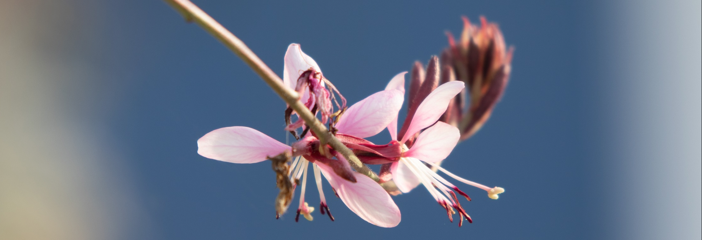

Notes from the course [*Statistical Methods for Microbiome Analysis*](https://mesioupcub.masters.upc.edu/en/xv-summer-school-2022/courses/statistical-methods-for-microbiome-analysis), organized by MESIO UPC-UB XV Summer School.  

The course was taught by [Malu Calle](https://mon.uvic.cat/bms/members/malu/), from Universidad de Vic. 

I took the course presentially in the [Faculty of Mathematics and Statistics of the UPC](https://goo.gl/maps/8EPcCEvetAzZStP3A) from 20 to 23 June of 2022. 

**In total, the course lasted 15 hours**

## Course objectives

1. Descriptive analysis and visualization of microbiome data

2. Microbioal abundance abundances are compositional: problems and proposal

3. Differential abundance analysis (mainly for small datasets):

	- **Multivariate:** Are there differences between microbial abundances?
	- **Univariado:** Which are the microorganisms that are differentially abundant? 

## Notes

**This notes focus on the theoretical parts of the course**, mainly on the objectives (1) and (2). The practical part was not so interesting for me at the time. Anyway, the code generated during the course is fairly well documented and available in the "Materials" section. Also, the tutorials provided by Malu are very well documented and contain most of the code that we worked on during the course. 